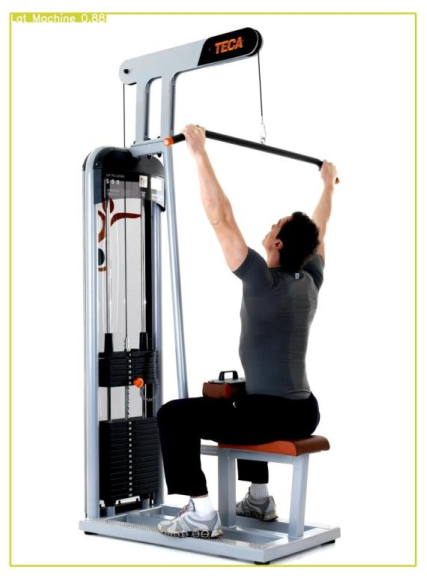

# FitnessEquipmentDetector

Link al repository ufficiale di yolov5: https://github.com/ultralytics/yolov5 <br><br>
Link al datset utilizzato: https://drive.google.com/drive/folders/1zjil5UGwYDGZs2xewSqFMS-Y7PSqzbD_?usp=sharing <br>
Inserisci la cartella *dataset* al seguente percorso: *FitnessEquipmentDetector/Yolov5/data*
<br><br>

Installa le dipendenze e i requisiti dal repository ufficiale.<br>
Per maggiori informazioni consulta il file "Documentazione".<br><br>

Per i dettagli dell'applicazione Android, consultare il file Readme.md presente nella cartella FitnessDetector_APP.

# Creazione del dataset

Dataset formato da:
- 35 imamgini per la classe Ball;
- 35 imamgini per la classe Box;
- 35 imamgini per la classe Gym Weights;
- 35 imamgini per la classe Lat Machine;
- 35 imamgini per la classe Kettleball;
- 35 imamgini per la classe Step;
- 35 immagini per la classe Punching Bag.

Le immagini sono divise in tre cartelle: train (70%), valid (20%) e test (10%). <br>
Tutte le immagini sono state etichettate manualmente attraverso la piattaforma Roboflow Annotate: https://blog.roboflow.com/labelimg/. <br>
Dopo la fase di preprocessing e dopo aver applicato degli aumenti, esportiamo il modello nel formato *YOLOv5 PyTorch*.

# Fase di training

Per prima cosa occorre copiare il file esportato nella cartella *data/dataset* del progetto. <br>
La cartella dataset, conterrà tre cartelle: *test,train,valid* contenenti a lro volta le cartelle *labels* e *images*. <br><br>

Creiamo quindi il nostro file di configurazione *data.yaml* e lo inseriamo nella cartella *data/dataset*.<br>
Il file contiene il path del dataset, della cartella valid,train e test; il numero delle classi comn i realtivi nomi: <br><br>
```
                           path:  .../data/dataset<br>
                           valid:  .../data/dataset/valid/images<br>
                           train:  .../data/dataset/train/images<br>
                           test:   .../data/dataset/test/images <br> <br>
                           nc: 7 <br> 
                           names: ['Ball', 'Box', 'Gym Weights', 'Kettlebell', 'Lat Machine', 'Punching Bag', 'Step'] <br><br>
```

Scegliamo poi il modello con cui addestrare il dataset. <br>
In questo progetto usiamo Yolov5s disponibile al seguente link: https://github.com/ultralytics/yolov5/releases.

Lo script da eseguire per il training è il seguente: <br>
`python train.py --img 640 --batch 16 --epochs 100 --data /Users/Utente/Desktop/FitnessEquipmentDetector/yolov5/data/dataset/data.yaml --weights yolov5s.pt`<br>

Al termine di questa fase otteniamo  il modello addestrato: *best.pt* <br>

# Esegui da termianle 

Gli script da eseguire per avviare il sistema da terminale sono i seguenti: <br><br>
**WEBCAM**<br>
`python detect.py --weights runs/train/exp/weights/best.pt --img 640 --source 0` <br>

**FOTO**<br>
`python detect.py --weights runs/train/exp/weights/best.pt --img 640 --source C:/Users/Utente/Desktop/FitnessEquipmentDetector/yolov5/data/images/gymWeights.jpg `<br>

**VIDEO**<br>
`python detect.py --weights runs/train/exp/weights/best.pt --img 640 --source C:/Users/Utente/Desktop/FitnessEquipmentDetector/yolov5/data/video/box.mp4`


<p>Esempi di test eseguiti:
 <br>

          
